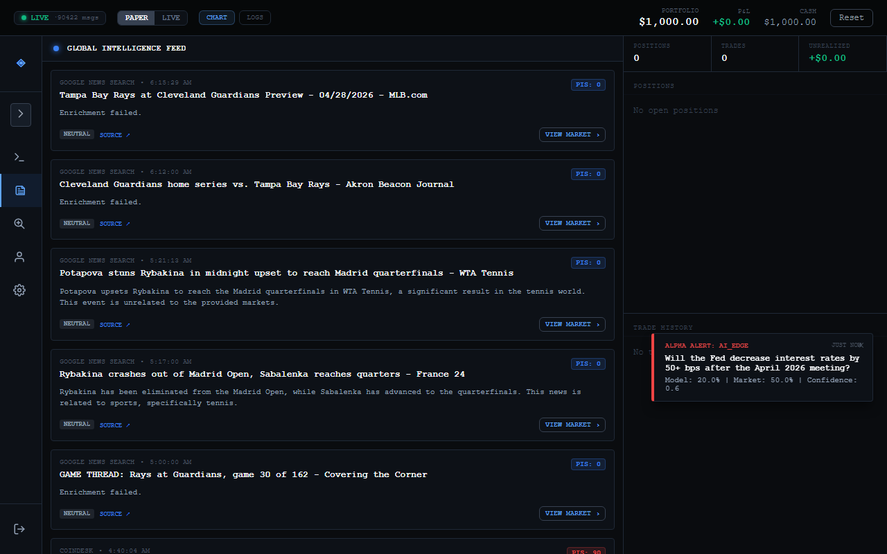
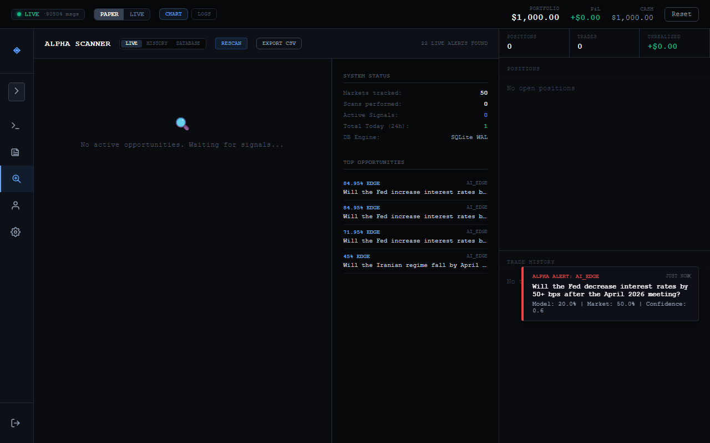
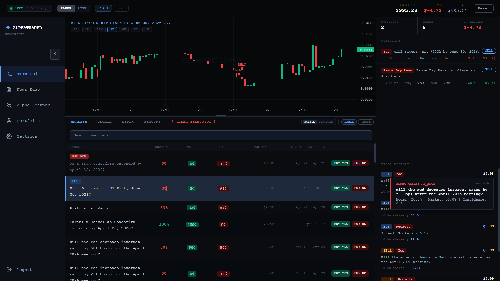

# AlphaTrader: High-Fidelity Discovery & Intelligence Terminal

AlphaTrader is a sophisticated, monospace-styled terminal for real-time market discovery and execution. Built for traders who prioritize speed and information edge, it integrates with **Polymarket** to provide real-time price feeds, automated arbitrage scanning, and AI-driven news intelligence.

## 🚀 Core Modules

### 1. News Edge (Intelligence)

A dedicated research engine that aggregates global signals and transforms them into actionable market insights.

### 2. Alpha Scanner (Discovery)

An autonomous discovery engine that works in the background to surface high-probability edges.

### 3. Trading Terminal (Execution)

The main workspace for manual analysis and trade management.
*   **Professional Charting**: High-performance candlestick charts powered by Lightweight Charts.
*   **News Spike Correlation**: Visual indicators directly on the chart (red circle markers) linking enriched news events to specific price actions.
*   **Real-Time AI Alerts**: Integrated notification system surfacing high-confidence model edges (e.g., `AI_EDGE` alerts) with fair-probability estimates.
*   **Full Order Books**: Real-time L2 depth relay from the Polymarket CLOB.
*   **Dual Mode**: Seamlessly toggle between **PAPER** (simulated) and **LIVE** (mainnet) trading.
*   **Modular UI**: Context-aware layout that hides terminal clutter when performing deep research or scanner analysis.

## 🛠 Tech Stack

*   **Frontend**: React, Vite, Lightweight Charts, Tailwind CSS.
*   **Backend**: FastAPI (Python 3.11+), Uvicorn, Websockets.
*   **Intelligence**: Groq SDK (Llama 3.3-70b-versatile).
*   **Persistence**: SQLite (WAL mode) and local JSON.

## 🏁 Quick Start

### 1. Requirements
*   Python 3.11+
*   Node.js & npm
*   A Groq API Key (for discovery/research features)

### 2. Environment Setup
Create a `.env` file in the root directory:
```env
POLY_API_KEY=your_polymarket_key
POLY_SECRET=your_polymarket_secret
POLY_PASSPHRASE=your_passphrase
POLY_PRIVATE_KEY=your_private_key
GROQ_API_KEY=your_groq_api_key
```

### 3. Launch the System
On Windows, simply run:
```cmd
run_app.bat
```
This will automatically launch the Backend, Alpha Worker, and Frontend in separate synchronized windows.

## 📁 Architecture
*   `/scripts`: Modular Python backend including the autonomous `scanner_worker.py`.
*   `/components`: Reusable React UI components.
*   `detector.db`: Local intelligence database (not committed).

---
*Built for the edge. Optimized for the terminal.*
